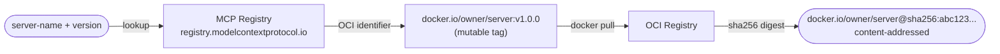
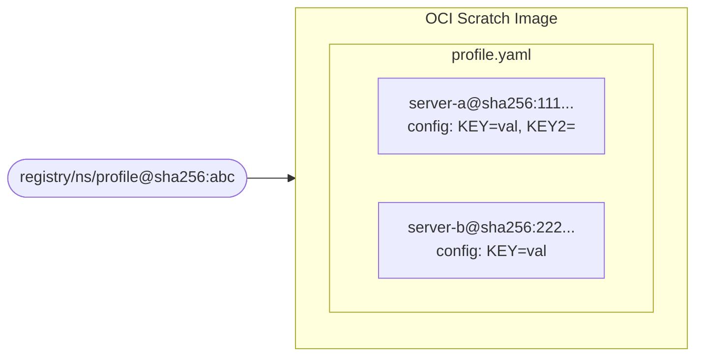

# Distributing MCP Servers With OCI To Power Agent Skills

**Bobby House**
Sr. Software Engineer, Docker

---

## Motivation

An agent skill is a markdown file. It references tools by name. Those tools are provided by MCP servers. That's a dependency — and we need a way to manage it.

**Goals**

* **Addressable** — a single immutable reference, no drift
* **Configurable** — configuration must be part of the dependency, set by the skill author or deferred to the user
* **Decoupled** — MCP servers should have their own versioning and release cycle, referenced as dependencies rather than bundled with the skill

---

### Why not `.mcp.json`?

The obvious first approach — ship an `.mcp.json` with the skill listing the MCP servers it needs.

**Two problems a dependency shouldn't have**

* **It defines runtime** — an execution model, not a dependency declaration
* **Configuration is static** — cannot be deferred to the user

---

### Why not `server.json`?

The file needs modification — the schema is closer, but has gaps.

* Tags may need resolving to digests *(Addressable)*
* We want to supply or override values *(Configurable)*
* `isRequired`, `default`, `placeholder` ≠ "who provides this value?"

Worth exploring — feels very close.

---

## Authoring

Let's build a skill. The dependency is a profile — a YAML manifest packaged as an OCI artifact and stored in a registry.

---

### Example

Invoking skill-builder to create a meditations skill:

```
Use skill-builder

name: meditations

short-description: get a passage from marcus aurelius meditations

details: use io.github.bobbyhouse.project-gutenberg-mcp@1.2.0 and io.github.bobbyhouse.append-log-mcp@1.0.0 to get
passages from meditations and use log to see if we have already seen that passage. If we have already seen that passage
get another passage, we only care that we haven't seen the same passage within the last 30 days. With the raw passage
text, provide just a small excerpt that includes the original text and a terse interpretation
```

---

### List of servers

*(Goal: Addressable + Decoupled)*



---

### Configuration

*(Goal: Configurable)*

Configuration with values either specified by the skill author or explicitly left for the user to supply.

```
1 name: meditations-profile
2 servers:
3   - name: io.github.bobbyhouse/project-gutenberg-mcp
4     identifier: roberthouse224/project-gutenberg-mcp@sha256:6460cba7b27343be72a85cbf5484e024711eb3...
5     config:
6       GUTENBERG_BASE_URL: # undefined — user supplies this
7       GUTENBERG_TOOLS: list_passages,get_passage
8       GUTENBERG_BOOK_ID: "2680"
9   - name: io.github.bobbyhouse/append-log-mcp
10     identifier: roberthouse224/append-log-mcp@sha256:5008d346d8c653caab0309999e694a2a63cf3b2c3bcb7...
11     config:
12       APPEND_LOG_TOOLS: append,query
13       APPEND_LOG_FILE: /data/log.jsonl 
```

---

### Single Dependency



---

### Demo

Invoke the meditations skill — no gateway, just the profile.

---

### Issues
* No good way to "load" the servers
* No lifecycle management — no clean way to uninstall or reload servers

---

## Gateway + Profile Pattern

A thin, client-agnostic MCP layer that manages the runtime lifecycle of your servers.

* Reads the profile, pulls and loads servers
* Handles what the profile alone cannot — load, reload, unload
* Opens the door to further leveraging the dependency file

---

### Demo

Invoke the meditations skill with the gateway — same skill, smoother experience.

---

## Closing

This Profile and Gateway pattern I mentioned is essentially what we implemented at Docker in our open source project MCP Gateway as part of an experimental feature we called Profiles.
